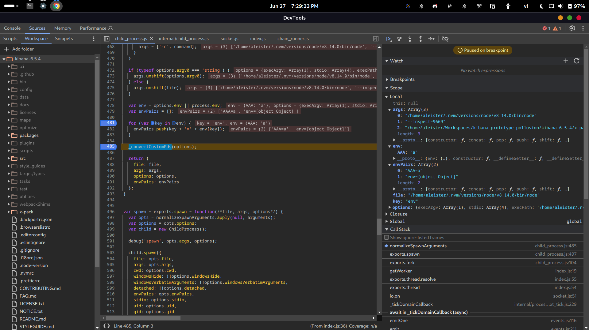
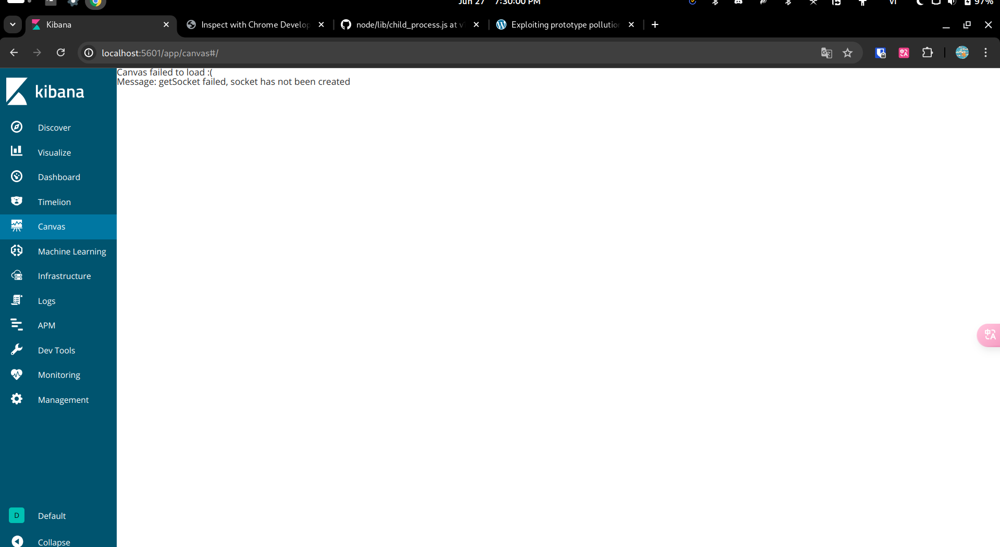
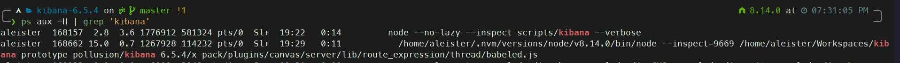
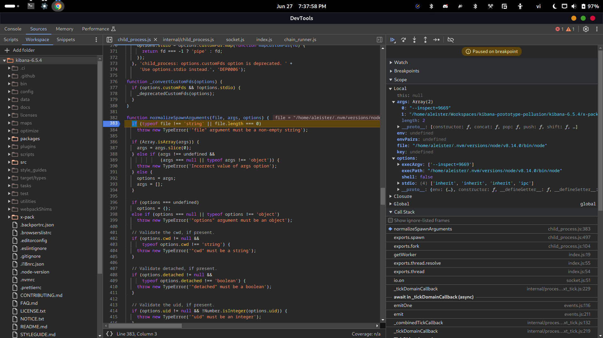
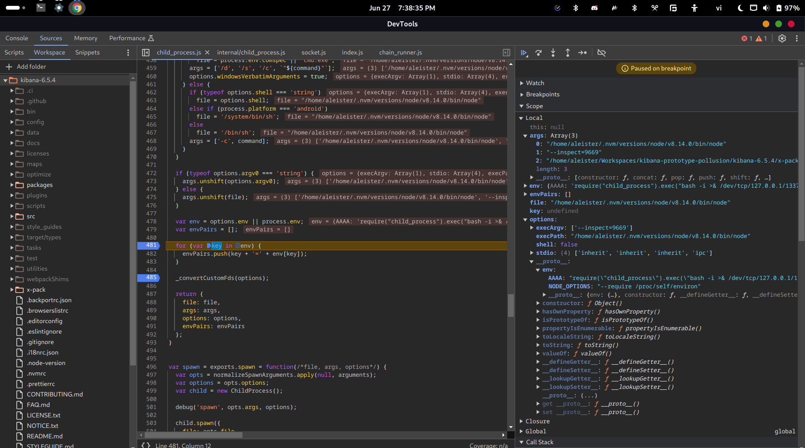

`fork` return a `ChildProcess` that can be used to spawn: https://nodejs.org/api/child_process.html#child_processforkmodulepath-args-options

Change port when invoke `fork` function to `9669` and then we can debug the main process normally:

Simulate the polluted Object.prototype and jump to before the loop:

As we can see, `env` is equivalent to `{AAA: 'a'}` due to prototype pollution.

After the loop:

Somehow, with the invalid environment variables (`AAA=a`, `env=[Object object]`), canvas can not create a new socket:

But the child process still can be created:

Indeed, it creates a new WebSocket connection:

Now try with the payload ``:

As we can see, the stack trace is the same.

But, the `env` is polluted:

Voila!

The `envPairs` after the loop:

And we got the reverse shell:

