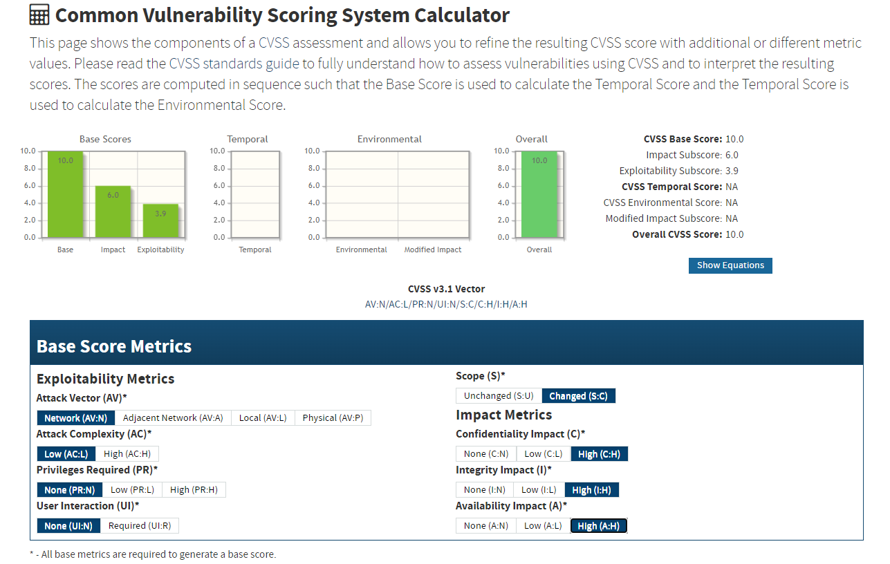
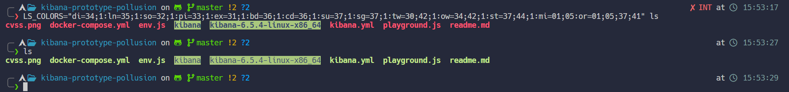

# CVE-2019-7609

> Kibana versions before 5.6.15 and 6.6.1 contain an arbitrary code execution flaw in the Timelion visualizer. An attacker with access to the Timelion application could send a request that will attempt to execute javascript code. This could possibly lead to an attacker executing arbitrary commands with permissions of the Kibana process on the host system.

CVSS:



Blog: https://research.securitum.com/prototype-pollution-rce-kibana-cve-2019-7609/

Payload: https://github.com/mpgn/CVE-2019-7609

## Target

Setup:
- Docker: https://www.elastic.co/guide/en/kibana/8.14/docker.html
- [Docker Compose](docker-compose.yml)

Using:
- Kibana: https://www.elastic.co/guide/en/kibana/current/development-getting-started.html
- Timelion: https://www.elastic.co/guide/en/kibana/5.4/timelion.html

## Analysis

`NODE_OPTIONS`: https://nodejs.org/api/cli.html#node_optionsoptions

When open a canvas, Kibana will call `child_process.spawn` function.

Where `child_process.spawn` is a function used for [spawning a child process](https://nodejs.org/api/child_process.html#child_processspawncommand-args-options). Its code:

```js
// src: https://github.com/nodejs/node/blob/7e5bf80fd1a06655564ea88f5d7867b3f4fc7da0/lib/child_process.js#L542
function spawn(file, args, options) {
  const child = new ChildProcess();

  options = normalizeSpawnArguments(file, args, options);
  debug('spawn', options);
  child.spawn(options);

  return child;
}
```

As we can see, the function `child_process.spawn` will call `normalizeSpawnArguments` function, its code has this snippet:

```js
// src: https://github.com/nodejs/node/blob/7e5bf80fd1a06655564ea88f5d7867b3f4fc7da0/lib/child_process.js#L404
function normalizeSpawnArguments(file, args, options) {
  // ...
  const env = options.env || process.env;
  const envPairs = [];
  // ...
  // Prototype values are intentionally included.
  for (const key in env) {
    const value = env[key];
    if (value !== undefined) {
      envPairs.push(`${key}=${value}`);
    }
  }
  // ...
}
```

Example of a command that can be configured through environment variables:



About `process.exit()`:

The process.exit() method instructs Node.js to terminate the process synchronously with an exit status of code. If code is omitted, exit uses either the 'success' code 0 or the value of process.exitCode if it has been set. Node.js will not terminate until all the 'exit' event listeners are called.

To exit with a 'failure' code:

```js
process.exit(1);
```

The shell that executed Node.js should see the exit code as 1.

Calling process.exit() will force the process to exit as quickly as possible even if there are still asynchronous operations pending that have not yet completed fully, including I/O operations to process.stdout and process.stderr.

In most situations, it is not actually necessary to call process.exit() explicitly. The Node.js process will exit on its own if there is no additional work pending in the event loop. The process.exitCode property can be set to tell the process which exit code to use when the process exits gracefully.