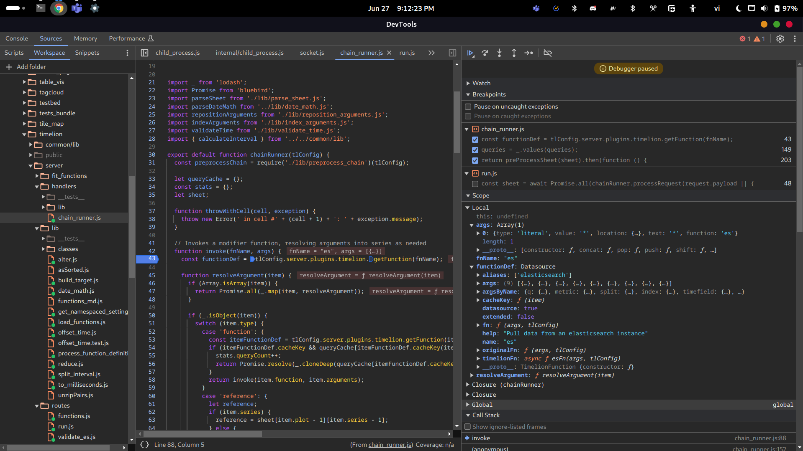
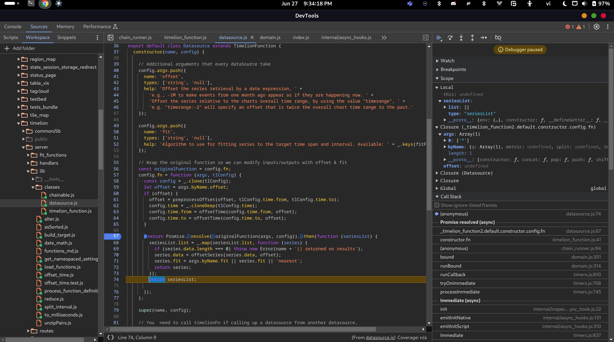
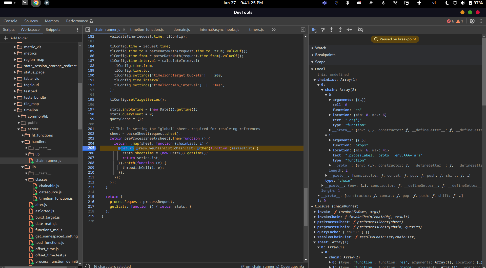
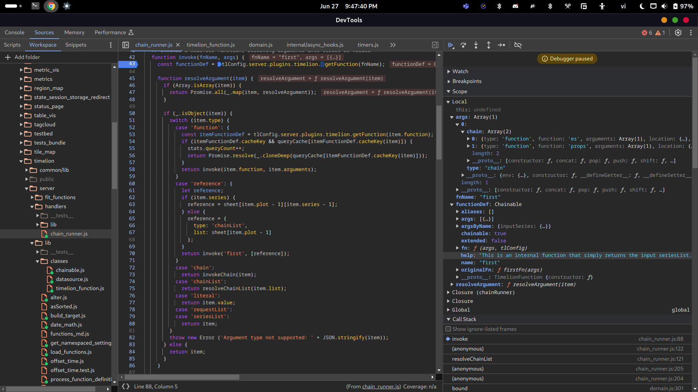
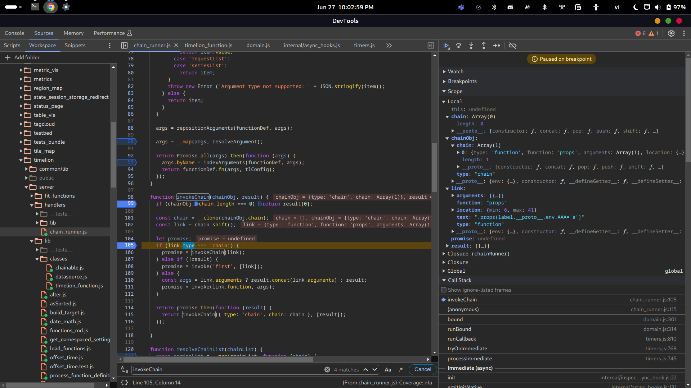
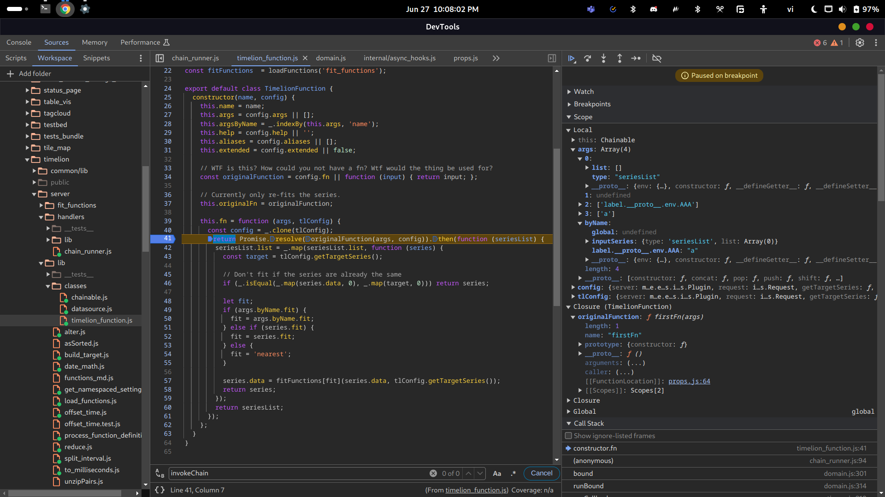
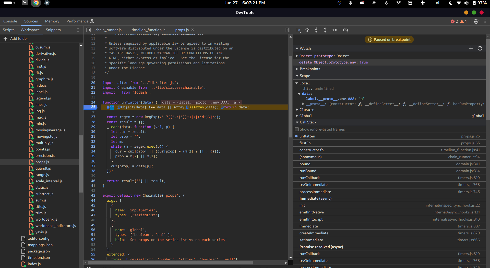
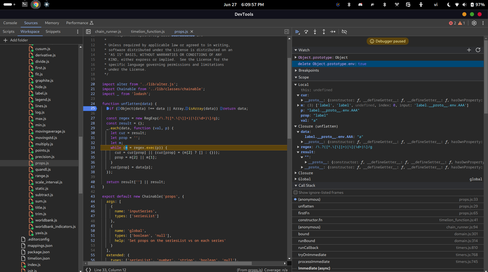
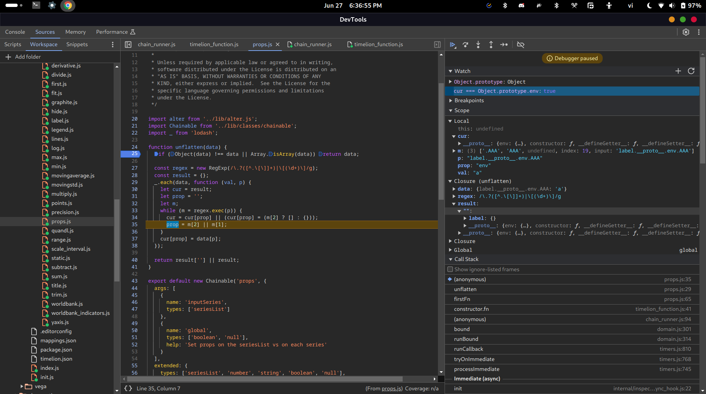
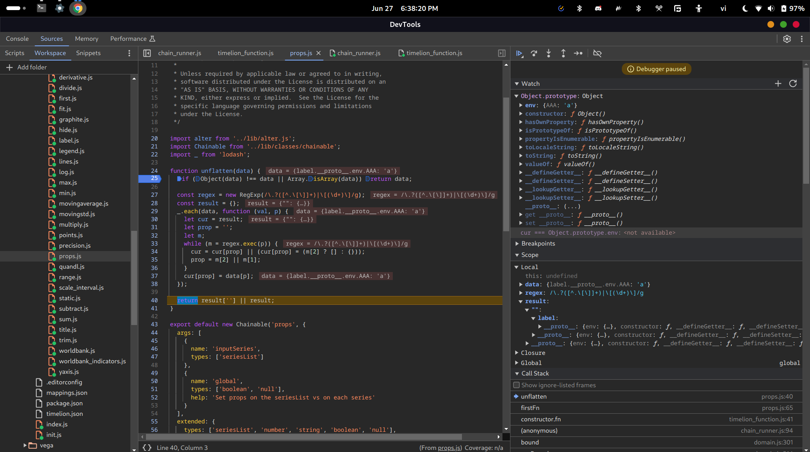

# CVE-2019-7609

> Kibana versions before 5.6.15 and 6.6.1 contain an arbitrary code execution flaw in the Timelion visualizer. An attacker with access to the Timelion application could send a request that will attempt to execute javascript code. This could possibly lead to an attacker executing arbitrary commands with permissions of the Kibana process on the host system.

CVSS:


Blog: https://research.securitum.com/prototype-pollution-rce-kibana-cve-2019-7609/

Payload: https://github.com/mpgn/CVE-2019-7609

## Target

Setup:
- Docker: https://www.elastic.co/guide/en/kibana/8.14/docker.html
- [Docker Compose](docker-compose.yml)

Using:
- Kibana: https://www.elastic.co/guide/en/kibana/current/development-getting-started.html
- Timelion: https://www.elastic.co/guide/en/kibana/5.4/timelion.html

## Analysis

### Timelion

After parsing sheet:


After pre-process sheet, we have a `queries` object:


Then, we loop over the `queries` array (which is converted to an array by using `values` method) and pass into `invoke` the `query.function` and `query.arguments` for invoking the function.

In the `invoke` function, first we get the definition of the function based on its name (`query.function`):



This function definition includes three types of function: `fn`, `originalFn` and `timelionFn`. Then, it loop over the `args` (which is `query.arguments`) and resolve arguments:


In this case, the argument in `args` is an object with `'literal'` type so it just return the literal value:


Actually, the value is wrapped in a promise.


The indexed argument is an argument with `byName` object that has `q` array inside it:


After that, the `invoke` function will call `functionDef.fn`, which is a function of the `Timelion` class, with all of the indexed arguments:


The `fn` function will call the `originalFn`, which comes from `config.fn` where `config` is `tlConfig`. And that function is `fn` of `Datasource extends Timelion` class:


As we can see, it calls to another `originalFn` named `esFn` which returns a `seriesList` object:


That function is used for "Pull data from an elasticsearch instance" by calling `callWithRequest` function.

The `seriesList` looks like this in `Datasource.fn`:



And it looks like this in `Timelion.fn`:


After pre-process sheet, the chain list is:



And the code will call the `resolveChainList` for resolving the chain list:


Each chain will be mapped to a Promise that is returned from a function that `invoke` with `'first'` as `fnName` and the chain itself as `args`.


The function definition is get by the name again:



This time, `resolveArguments` receive `args` as an array and it will call the `resolveArguments` recursively for resolving each argument. But, we have only one argument with index `0`. And that argument is an object with `type ==  chain`.

So, in the switch case, it will call the `invokeChain` function and pass the chain object into it:


Inside the invoke chain, it will `shift` the `chain` array. The `shift` function will return the removed element so `link` will be `es` object:


Because the type of `es` is not `'chain'` (it is `'function'`) and `!result` is truthy, the code calls the `invoke` function with `'first'` as `fnName` the `es` object as `args`:

This time, the procedure is the same as above so skip to the call of `invokeChain` with `link` is `props` object:



Again, the code calls the `invoke` function with `'first'` as `fnName` the `props` object as `args`:


The `originalFn` of `props` now is `firstFn` instead of `fn` like `es` and only accept one argument:


That original function is will eventually call the vulnerable `unflatten` function. Actually, it will call the `fn` of `Timelion` first. Then `fn` will call the `originalFn` of `props`:



The `firstFn` of `props` will omit the `inputSeries` and `global` properties in `byName` object of `args`:


So the `data` passed into `unflatten` will be:

```js
{
    label.__proto__.env.AAA: "a"
}
```

Proof:


### Unflatten

Use `props(label.__proto__.env.AAA="a")`. The `data` will look like this:



At the first iteration, `prop = ''` is not exist, it will assign `cur[''] = {}`. This means, the `result` will also have a property named `''` with an empty object as value. After that, `cur` is assigned with `{}`, which is the return value of the previous assignment (`cur` and `cur[prop]` both point to the same object):


Now, `prop` will become `'label'`:



Same as before, `result` will have `'label'` property and `prop` will become `__proto__`:


With the third iteration, `cur` will be come its prototype as `__proto__` always exist in every object:


After that, `prop` becomes `env`.

Then, due to `cur` is point to `Object.prototype`, it will add `env` to the `Object.prototype` as an empty object and **`cur` also reference to `env` inside `Object.prototype.env`**.



After that, the loop will exit and the `cur[prop] = data[p]` will be equivalent to `env[AAA] = 'a'`.


The `Object.prototype` is polluted with `env`:



### Canvas

> [The `fork` function return a `ChildProcess` that can be used to invoke `spawn`](https://nodejs.org/api/child_process.html#child_processforkmodulepath-args-options)

Change port when invoke `fork` function to `9669` (another port) and then we can debug the main process normally:


Simulate the polluted `Object.prototype` and jump to before the loop:


As we can see, `env` is equivalent to `{ AAA: 'a' }` due to prototype pollution. More specific, `env` is assigned to `options.env`. And `options` does not define that property so it will use the value of its prototype.

After the loop:


Somehow, with the invalid environment variables (`AAA=a`, `env=[Object object]`), canvas can not create a new socket:


But the child process still can be created:


With normal flow, it will create a new WebSocket connection:


Now try with the payload and jump in the `normalizeSpawnArguments`:


As we can see, the stack trace is the same.

But, the `env` is polluted:


Voila!

The `envPairs` after the loop:


And we got the reverse shell:


### Spawn

After calling to `normalizeSpawnArguments` in `spawn` function:


As we can see, the `envPairs` contains our payload. Also, after that, `spawn` will call to the `spawn` function inside `internal/child_process.js`:


The `options` variable will be passed into `this._handle.spawn`:


Where `this._handle` is a handle to a process:


## Patch

```diff
From 3377f813a5d96ff466bdf7343ce161de24830ed4 Mon Sep 17 00:00:00 2001
From: ppisljar <peter.pisljar@gmail.com>
Date: Wed, 16 Jan 2019 06:01:20 -0800
Subject: [PATCH] fixes

---
 .../core_plugins/timelion/server/series_functions/props.js      | 2 +-
 1 file changed, 1 insertion(+), 1 deletion(-)

diff --git a/src/legacy/core_plugins/timelion/server/series_functions/props.js b/src/legacy/core_plugins/timelion/server/series_functions/props.js
index 81b74901d4db..80e9cafd6712 100644
--- a/src/legacy/core_plugins/timelion/server/series_functions/props.js
+++ b/src/legacy/core_plugins/timelion/server/series_functions/props.js
@@ -32,7 +32,7 @@ function unflatten(data) {
     let prop = '';
     let m;
     while (m = regex.exec(p)) {
-      cur = cur[prop] || (cur[prop] = (m[2] ? [] : {}));
+      cur = (cur.hasOwnProperty(prop) && cur[prop]) || (cur[prop] = (m[2] ? [] : {}));
       prop = m[2] || m[1];
     }
     cur[prop] = data[p];
```

