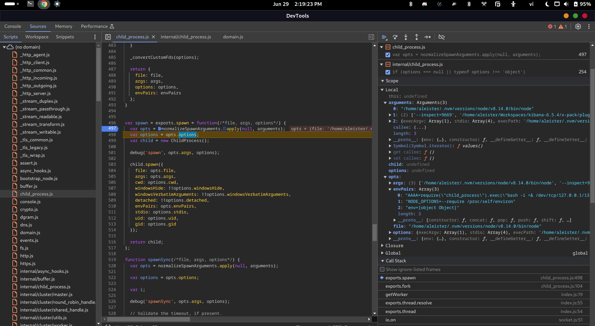
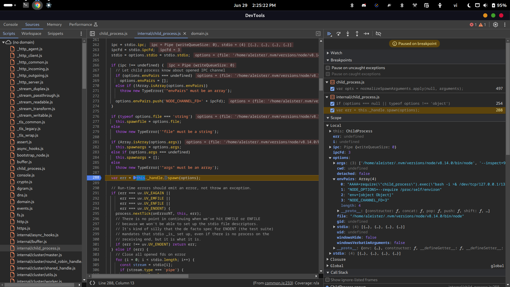

After calling to `normalizeSpawnArguments` in `spawn` function:

As we can see, the `envPairs` contains our payload. Also, after that, `spawn` will call to the `spawn` function inside `internal/child_process.js`:

The `options` variable will be passed into `this._handle.spawn`:

Where `this._handle` is a handle to a process:

