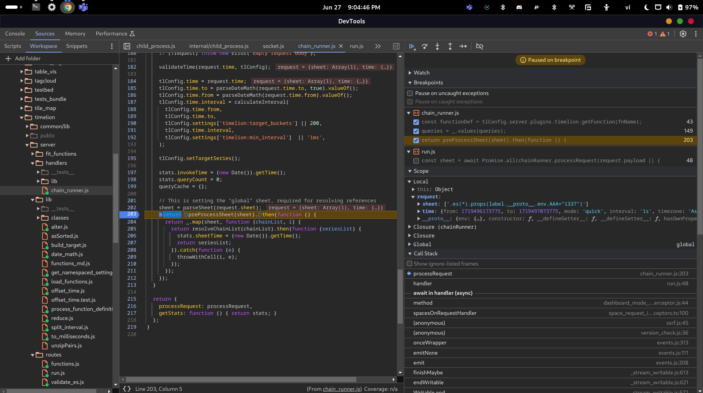
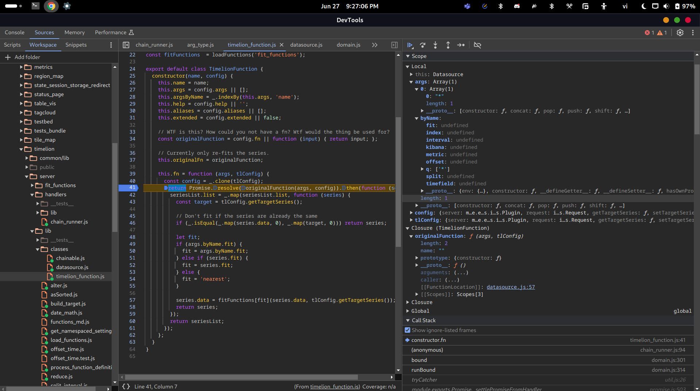
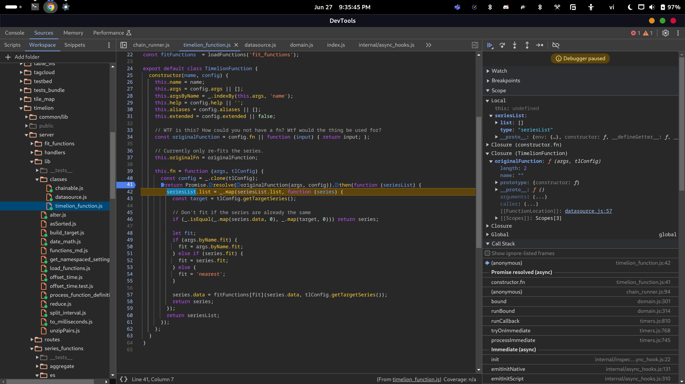
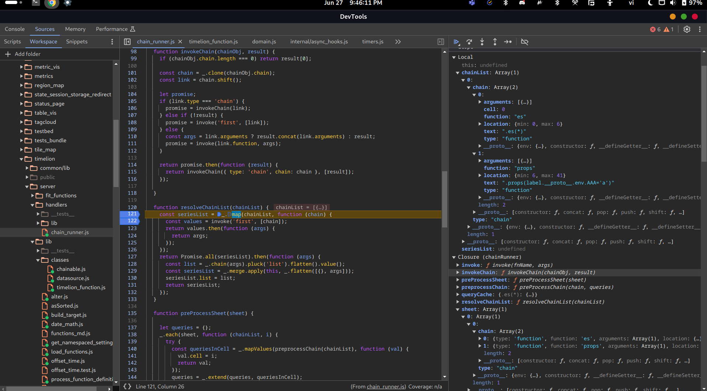

After parsing sheet:



After pre-process sheet, we have a `queries` object:


Then, we loop over the `queries` array (which is converted to an array by using `values` method) and pass into `invoke` the `query.function` and `query.arguments` for invoking the function.

In the `invoke` function, first we get the definition of the function based on its name (`query.function`):


This function definition includes three types of function: `fn`, `originalFn` and `timelionFn`. Then, it loop over the `args` (which is `query.arguments`) and resolve arguments:


In this case, the argument in `args` is an object with `'literal'` type so it just return the literal value:


Actually, the value is wrapped in a promise.


The indexed argument is an argument with `byName` object that has `q` array inside it:


After that, the `invoke` function will call `functionDef.fn`, which is a function of the `Timelion` class, with all of the indexed arguments:



The `fn` function will call the `originalFn`, which comes from `config.fn` where `config` is `tlConfig`. And that function is `fn` of `Datasource extends Timelion` class:


As we can see, it calls to another `originalFn` named `esFn` which returns a `seriesList` object:


That function is used for "Pull data from an elasticsearch instance" by calling `callWithRequest` function.

The `seriesList` looks like this in `Datasource.fn`:


And it looks like this in `Timelion.fn`:



After pre-process sheet, the chain list is:


And the code will call the `resolveChainList` for resolving the chain list:



Each chain will be mapped to a Promise that is returned from a function that `invoke` with `'first'` as `fnName` and the chain itself as `args`.


The function definition is get by the name again:


This time, `resolveArguments` receive `args` as an array and it will call the `resolveArguments` recursively for resolving each argument. But, we have only one argument with index `0`. And that argument is an object with `type ==  chain`.

So, in the switch case, it will call the `invokeChain` function and pass the chain object into it:


Inside the invoke chain, it will `shift` the `chain` array. The `shift` function will return the removed element so `link` will be `es` object:


Because the type of `es` is not `'chain'` (it is `'function'`) and `!result` is truthy, the code calls the `invoke` function with `'first'` as `fnName` the `es` object as `args`:

This time, the procedure is the same as above so skip to the call of `invokeChain` with `link` is `props` object:


Again, the code calls the `invoke` function with `'first'` as `fnName` the `props` object as `args`:


The `originalFn` of `props` now is `firstFn` instead of `fn` like `es` and only accept one argument:


That original function is will eventually call the vulnerable `unflatten` function. Actually, it will call the `fn` of `Timelion` first. Then `fn` will call the `originalFn` of `props`:


The `firstFn` of `props` will omit the `inputSeries` and `global` properties in `byName` object of `args`:


So the `data` passed into `unflatten` will be:

```js
{
    label.__proto__.env.AAA: "a"
}
```

Proof:


